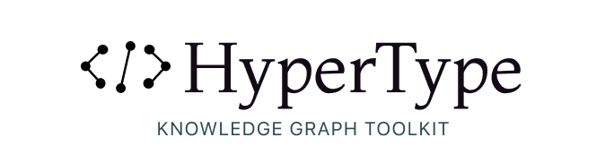

## HyperType



<div class="badges" style="text-align: center; margin-top: -10px;">
<a href="https://github.com/themaximal1st/hypertype"></a>
<a href="https://www.npmjs.com/package/@themaximalist/hypertype"></a>
<a href="https://github.com/themaximal1st/hypertype"></a>
<a href="https://github.com/themaximal1st/hypertype"></a>
</div>
<br />

> Multidimensional Mind Mapping
>
> Interwingled Information Language
>
> HyperText over Hypergraphs
>
> A Language for Learning
>
> Cognitive Cartography
>
> A Database for Dreamers
>
> An IDE for Imagination
>
> A DSL for Data Explorers
>
> Strange Loop Language
>
> Tangled Hierarchy Hypergraph
>
> A Knowledge Graph Toolkit

HyperType is a way to represent concepts, ideas and information.

It's great at building [knowledge graphs](https://hypertyper.com) and aims to work the way you think.

It's simple. It's based on a hypergraph, which doesn't sound simple, but it is:

```yaml
Ted Nelson,invented,HyperText
```

That's it, a series of connected ideas. Typically separated by a `,` or `->`

```yaml
Tim Berners-Lee -> invented -> WWW
```

What matters less is the syntax, and more that there are only two things:

* Symbols
* Connections

Together these form the building blocks of HyperType.


## A New Kind of Knowledge Graph

Current knowledge graphs limit how we think. They don't visualize information in the way it's actually shaped.

Mind Mapping tries to squeeze complex relationships into a 2D hierarchy—stripped of context, interconnections and intuition.

HyperType is not about creating a simplified view of some information in your head—it's about getting lost in the forest, discovering deep insights, and finding your way back.

Here is [HyperTyper](https://hypertyper.com), a frontend UI to HyperType.

<video src="videos/hypertyper.mp4" autoplay muted loop></video>


## Creating a .hypertype file

Creating a `.hypertype` file is as simple as creating a text file with one or more of these connected ideas.

```yaml
Ted Nelson -> invented -> HyperText
Tim Berners-Lee -> invented -> WWW
HyperText -> influenced -> WWW
```

HyperType reads this file, builds the symbols and connections—and understand these ideas are interconnected.

Interconnectedness is a core idea in HyperType—called **interwingle**. Interwingle means knowledge is deeply interconnected and there isn't a clean way to divide it up.

HyperType provides this tool and many more to work with your information.

From PageRank, to Text Similarity, to LLMs, HyperType wants you to do the hard work of thinking—and then it will do everything it can to help you hit the high notes.


## HyperTyping

HyperType is a lot of things. It's a DSL, it's a parser, it's a hypergraph database, it's a text similarity vector search engine, it's an AI Research Copilot.

But at it's core, it's just a library — and getting started is easy.

### Installing HyperType

Install HyperType from NPM:

```bash
npm install @themaximalist/hypertype
```

### Load .hypertype file

You can import an existing `.hypertype` file (a CSV file)

```javascript
import HyperType from "@themaximalist/hypertype"
const hypertype = HyperType.parse("ancient_sumerians.hypertype");

// or specify a different separator
const hypertype = HyperType.parse("secret_research_project.hypertype", {
  parse: {
    delimiter: " -> "
  }
});
```

#### Initialize with data

You can also initialize HyperType with an list of nodes and connections (called Hyperedges).

```javascript
const hyperedges = [
  ["Plato", "student", "Socrates"],
  ["Aristotle", "student", "Plato"]
];

const hypertype = new HyperType({ hyperedges });
```

#### Build programatically

Or you can build up a HyperType file programatically

```javascript
const hypertype = new HyperType();
hypertype.add("Vannevar Bush", "author", "As We May Think");
hypertype.add("Ted Nelson", "invented", "HyperText");
hypertype.add("As We May Think", "influenced", "HyperText");
```

You can also build up a Hyperedge

```javascript
const edge = hypertype.add("Vannevar Bush");
edge.add("invented");
edge.add("Memex");
```


### Visualize HyperType

Connections and visualizations are a core part of HyperType—so [Force Graph 3D](https://vasturiano.github.io/3d-force-graph/) is supported out of the box.

```javascript
const hypertype = new HyperType({
  hyperedges: [
    ["Hercules", "son", "Zeus"],
    ["Hercules", "son", "Alcmene"],
  ]
});
const data = hypertype.graphData(); // { nodes, links } for Force Graph 3D
```

In addition, an `interwingle` parameter is available to control the interconnections of the graph.


#### Interwingle Isolated

`Isolated` displays hyperedges exactly as they're entered, with no interconnections.

```javascript
const hypertype = new HyperType({
  interwingle: HyperType.INTERWINGLE.ISOLATED,
  hyperedges: [
    ["Hercules", "son", "Zeus"],
    ["Hercules", "son", "Alcmene"],
  ]
});

// hyperedges are displayed exactly as entered
const data = hypertype.graphData();
// Hercules -> son -> Zeus
// Hercules -> son -> Alcmene
```


#### Interwingle Confluence

`Confluence` connects common parents.

```javascript
const hypertype = new HyperType({
  interwingle: HyperType.INTERWINGLE.CONFLUENCE,
  hyperedges: [
    ["Hercules", "son", "Zeus"],
    ["Hercules", "son", "Alcmene"],
  ]
});

// nodes shares common ancestors
const data = hypertype.graphData();
//
//                  / Zeus  
//  Herculues -> son
//                  \ Alcmene
//
```


#### Interwingle Fusion

`Fusion` connects starts and ends.

```javascript
const hypertype = new HyperType({
  interwingle: HyperType.INTERWINGLE.FUSION,
  hyperedges: [
    ["Plato", "student", "Socrates"],
  	["Aristotle", "student", "Plato"]
  ]
});

// start and end nodes are fused together
const data = hypertype.graphData();
// Aristotle -> student -> Plato -> student -> Socrates
```


#### Interwingle Bridge

`Bridge` connects common symbols with a bridge.

```javascript
const hypertype = new HyperType({
  interwingle: HyperType.INTERWINGLE.BRIDGE,
  hyperedges: [
    ["Vannevar Bush", "author", "As We May Think"],
    ["Ted Nelson", "author", "Computer Lib/Dream Machines"],
    ["Tim Berners-Lee", "author", "Weaving the Web"]
  ]
});

// common symbols are connected through a bridge
const data = hypertype.graphData();
//
//  Vannevar Bush   -> author -> As We May Think
//                     |
//  Ted Nelson      -> author -> Computer Lib/Dream Machines
//                     |
//  Tim Berners-Lee -> author -> Weaving the Web
```


These four views give you control in how to visualize your knowledge graph and control interconnections between your data.

As you scale up the `interwingle` parameter, all the visualization layers start to combine. Using `Fusion` automatically includes `Confluence`. And using `Bridge` automatically includes `Fusion` and `Confluence`. This lets you increase the complexity of the knowledge graph, step-by-step.


### PageRank

HyperType helps you find the most referenced symbols and connections by running `PageRank` on your knowledge graph.

```javascript
const hypertype = HyperType.parse(`A,B,C
A,B,D
A,B,E
A,C,Z`);

await hypertype.sync(); // syncs pagerank
hypertype.pageranks // { A: <num>, B: <num>, ... }
hypertype.pagerank("Z") // { A: <num>, C: <num>, ... }
```

Note, HyperType aims to work with very large knowledge graphs, so we keep expensive operations like `PageRank` explicit and in the background, controlled through `await hypertype.sync()` or `await hypertype.syncPagerank().`

### Embeddings and Vector Search

HyperType can find similar symbols and hyperedges, not only by the explicit connections, but by the text similarity.

Using [Embeddings.js](https://embeddingsjs.themaximalist.com) and [VectorDB.js](https://vectordbjs.themaximalist.com), HyperType can find hidden connections in your knowledge graph.

Note, both embeddings and vector search are local by default, but you can use embeddings from `OpenAI` with a few config lines.

#### Find Similar Symbols

```javascript
const hypertype = HyperType.parse("Red,Green,Blue\nWhite,Black,Gray");
await hypertype.sync();

await hypertype.similarSymbols("Redish"); // [ { symbol: "Red": distance: 0.5 } ]
```

#### Find Similar Hyperedges

```javascript
const hypertype = new HyperType();
const edge1 = hypertype.add("Red", "Green", "Blue");
const edge2 = hypertype.add("Red", "White", "Blue");
const edge3 = hypertype.add("Bob", "Sally", "Bill");

await hypertype.sync();

await edge1.similar(); // [ Hyperedge("Red", "White", "Blue") ]
await edge2.similar(); // [ Hyperedge("Red", "Green", "Blue") ]
```

### Searching

Searching in HyperType is easy, you can search by symbol, hyperedge or a partial hyperedge.

```javascript
const hypertype = new HyperType({
  hyperedges: [
    ["Ted Nelson", "invented", "Xanadu"],
    ["Tim Berners-Lee", "invented", "WWW"],
    ["Tim Berners-Lee", "author", "Weaving the Web"],
    // ...
  ]
});
hypertype.filter("invented").length; // 2
hypertype.filter("Tim Berners-Lee").length; // 2
hypertype.filter("Tim Berners-Lee", "invented").length; // 1
```

### AI Auto Suggest

HyperType has `suggest()` built in, which autocompletes any symbol or edge.

Using [LLM.js](https://llmjs.themaximalist.com), you can use any Large Language Model—like GPT-4, Claude, Mistral or local LLMs like [Llamafile](https://github.com/Mozilla-Ocho/llamafile).

```javascript
const options = {
    llm: {
        service: "openai",
        model: "gpt-4-turbo-preview"
        apikey: process.env.OPENAI_API_KEY
    }
};

const hypertype = new HyperType(options);
const hyperedge = hypertype.add("Steve Jobs", "inventor");
hyperedge.suggest(); // ["iPhone", "Macintosh", "iPod", ... ]
```

This makes programatically expanding knowledge graphs with LLMs incredibly easy!

### AI Generate

HyperType also has `generate()` built in, which generates hyperedges based on your prompt. This is a great way to expand your knowledge graph in a particular direction.

```javascript
const options = {
    llm: {
        service: "openai",
        model: "gpt-4-turbo-preview",
        apikey: process.env.OPENAI_API_KEY
    }
};

const hypertype = new HyperType(options);
const hyperedges = hypertype.generate("Steve Jobs");
// Steve Jobs,Apple Inc,CEO
// Steve Jobs,NeXT,Founder
// Steve Jobs,Macintosh,Personal Computers
// Steve Jobs,iPad,Tablet Computing
// ...
```


### CLI

HyperType ships with a command-line interfaces for generating HyperType files.

```bash
> hypertype epic of gilgamesh
epic of gilgamesh,sumerian literature,ancient civilization  
epic of gilgamesh,gilgamesh,enkidu,immortality,friendship  
sumerian literature,cuneiform writing,mesopotamia
...
```

By default it writes to stdout, either copy and paste to a `.hypertype` file or redirect the out

```bash
> hypertype mesopotamia > mesopotamia.hypertype
```


## The Design of HyperType

A language for ideas needs a structureless structure. That's exactly what Stephen Wolfram found hypergraphs to be while working on his Universal Theory of Physics project.

Ted Nelson created Zig Zag as a "hyperstructure" kit—a way to represent information in HyperText systems.

*HyperType combines these ideas*, using the hypergraph as the fundamental unit in the HyperText system.

HyperType is a lot closer to symbolic programming than iterative programming. In iterative programming, you describe every little step. In symbolic programming, you describe the high-level concepts. It's top-down rather than bottom-up.

Something magical happens with symbolic programming. Like a looking glass, "the program" is a reflection of the connected symbols. It's a lot like language. You have legalese and then you have poetry.

HyperType is not a programming language in and of itself—but this high-level connecting of ideas is creating a sum greater than it's parts.

HyperType is open source, and the file format is incredibly simple—just CSV files.

It's goal is to give you control over the knowledge and information in your life.

> File over app is a philosophy: if you want to create digital artifacts that last, they must be files you can control, in formats that are easy to retrieve and read. Use tools that give you this freedom.
>
> —[Steph Ango](https://stephango.com/file-over-app) (Obsidian Cofounder)


## Alpha

[HyperType](https://github.com/themaximal1st/hypertype) is under heavy development and still subject to breaking changes.


## Projects

HyperType is currently used in the following projects:

-   [HyperTyper](https://hypertyper.com)


## Author

-   [The Maximalist](https://themaximalist.com/)
-   [@themaximal1st](https://twitter.com/themaximal1st)


## License

MIT
